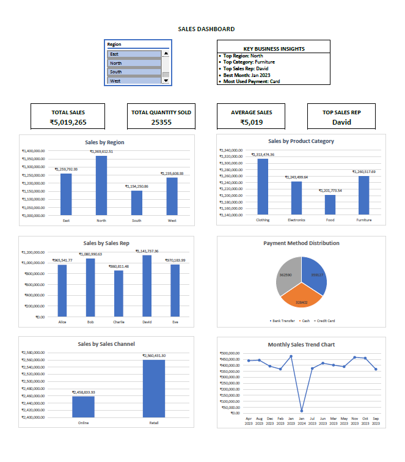

# Excel Sales Analytics Dashboard

## Project Overview

An Excel-based sales analytics project designed to analyze sales performance and transform raw sales data into meaningful business insights through an interactive dashboard.

## Business Objective

The objective of this project is to analyze sales performance across different business dimensions and present the results in a clear, interactive dashboard.

The analysis focuses on identifying patterns in:

- Regional sales performance
- Product category performance
- Sales representative performance
- Payment methods
- Sales channels
- Monthly sales trends

## Tools & Skills

- Microsoft Excel
- Data Validation
- Sorting & Filtering
- VLOOKUP
- IF
- SUMIF / SUMIFS
- COUNTIF
- ROUND
- RANK
- Percentage Analysis
- PivotTables
- Slicers
- Conditional Formatting
- KPI Cards
- Data Visualization
- Dashboard Design

## Analysis Performed

The project includes analysis of:

- Sales by Region
- Sales by Product Category
- Sales Representative Performance
- Payment Method Distribution
- Sales by Sales Channel
- Monthly Sales Trends
- Total Quantity Sold
- Average Sales
- Overall Sales Performance

## Dashboard

## Key Features

- Interactive Region slicer
- KPI cards for key sales metrics
- PivotTable-based analysis
- Monthly sales trend visualization
- Business insights section
- Conditional formatting
- Interactive filtering
- Professional dashboard layout

## Key Business Insights

The dashboard is designed to identify:

- Top-performing region
- Top-performing product category
- Top-performing sales representative
- Best-performing month
- Most-used payment method

## Project Files

- `Sales_Analytics_Dashboard.xlsx` — Complete Excel workbook
- `dashboard-preview.png` — Dashboard preview image
- `Sales_Analytics_Dashboard.pdf` — PDF version of the dashboard

## Skills Demonstrated

This project demonstrates practical skills in data analysis, Excel formulas, PivotTables, interactive filtering, KPI development, data visualization, and dashboard creation.
